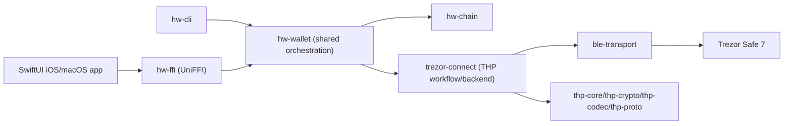

# hw-core

[](https://github.com/hewigovens/hw-core/actions/workflows/ci.yml)
[](https://deepwiki.com/hewigovens/hw-core)

Early-stage Rust workspace for host-to-hardware crypto wallets. The first milestone targets the Trezor Host Protocol (THP) with a transport/core stack intended to be shared across multiple vendors. 

- THP reference documentation: [trezor-firmware/docs/common/communication/thp.md](https://github.com/trezor/trezor-firmware/blob/m1nd3r/thp-documentation/docs/common/communication/thp.md).

## Roadmap

See [docs/roadmap.md](docs/roadmap.md) for what's implemented, current focus, and future plans. The v1 task tracker is at [docs/cli-wallet-v1.md](docs/cli-wallet-v1.md).

APIs are unstable while we iterate on the transport abstraction and vendor-agnostic workflow surface.

## Workspace layout

- `crates/thp-codec`: length/CRC framed THP packets with property tests.
- `crates/thp-crypto`: Noise XX + CPace helpers shared by higher layers.
- `crates/thp-core`: async session state machine that drives Noise handshakes and encrypted THP requests.
- `crates/thp-proto`: prost-generated THP protobufs and helper adapters.
- `crates/ble-transport`: btleplug-based BLE manager with pluggable wallet profiles.
- `crates/trezor-connect`: host-facing workflow API plus transport backends (BLE today, USB soon).
- `crates/hw-wallet`: shared wallet orchestration (BLE scanning, BIP32, helpers) for CLI and FFI.
- `crates/hw-cli`: interactive CLI for Trezor Safe 7 (scan, pair, address, sign).
- `crates/hw-ffi`: cdylib exposing the BLE manager + THP workflow over UniFFI (Swift/Kotlin).

## Architecture



## Feature flags

- `ble`: enables the BLE transport stack (btleplug, Noise handshake, pairing).
- `usb`: placeholder for the upcoming USB/HID transport implementation.

Build everything: `cargo build -p trezor-connect --all-features`. Build BLE-only: `cargo build -p trezor-connect --features ble`.

## Dev quickstart

```bash
cargo fmt --all
cargo clippy --workspace --all-targets --all-features
cargo test --workspace
```

Or use the `just` helpers described below.

## Tooling

Install [just](https://github.com/casey/just) and run:

```bash
just fmt              # format
just lint             # clippy (workspace)
just test             # cargo test --workspace
just build            # cargo build --workspace
just ci               # fmt check + lint + test (mirrors GitHub CI)
just scan-demo        # scan for Trezor devices over BLE
just workflow-demo    # drive the THP BLE workflow (requires a device)
just cli-scan         # scan via CLI
just cli-pair         # pair via CLI
just cli-pair-interactive
just cli-address-eth
just cli-sign-eth
```

## CLI usage (Trezor Safe 7)

Pair and start an interactive session:

```bash
cargo run -p hw-cli -- -vv pair --interactive
```

Fetch Ethereum address (default path `m/44'/60'/0'/0/0`):

```bash
cargo run -p hw-cli -- -vv address --chain eth --include-public-key
```

Sign an EIP-1559 transaction:

```bash
cargo run -p hw-cli -- -vv sign eth --path "m/44'/60'/0'/0/0" --tx '{"to":"0x000000000000000000000000000000000000dead","nonce":"0x0","gas_limit":"0x5208","chain_id":1,"max_fee_per_gas":"0x3b9aca00","max_priority_fee":"0x59682f00","value":"0x0"}'
```

Notes:

- Pairing state persists at `~/.hw-core/thp-host.json`; use `pair --force` to reset.
- Current v1 scope is BLE + Trezor Safe 7 + Ethereum flows.
- For `Peer removed pairing information`, remove device from OS Bluetooth settings then pair again.
- Some transient firmware busy states are retried automatically (notably device error codes 5/99).

## Examples

The BLE transport crate ships with a simple scanner that lists nearby Trezor devices:

```bash
cargo run -p ble-transport \
  --features trezor-safe7,backend-btleplug \
  --example scan_trezor
```

The `trezor-connect` crate includes an end-to-end BLE workflow demo:

```bash
cargo run -p trezor-connect \
  --features ble \
  --example ble_handshake
```

## FFI bindings

The `hw-ffi` crate builds a UniFFI-powered `cdylib` for consumers that need Rust-powered BLE scanning and THP workflows (e.g., mobile apps). Generate language bindings with:

```bash
just bindings  # writes Swift & Kotlin bindings under target/bindings/
```

The helper CLI supports additional languages. For manual invocation or alternate output locations:

```bash
cargo run -p hw-ffi --features bindings-cli --bin generate-bindings \
  --auto target/bindings/swift target/bindings/kotlin
```

Use `--lib <path>` if you want to point at a prebuilt library instead of auto-discovering `target/{debug,release}`.

On Ubuntu runners (including CI) install the Bluetooth dependencies before building the real BLE backend:

```bash
sudo apt-get update
sudo apt-get install -y libdbus-1-dev pkg-config
```
