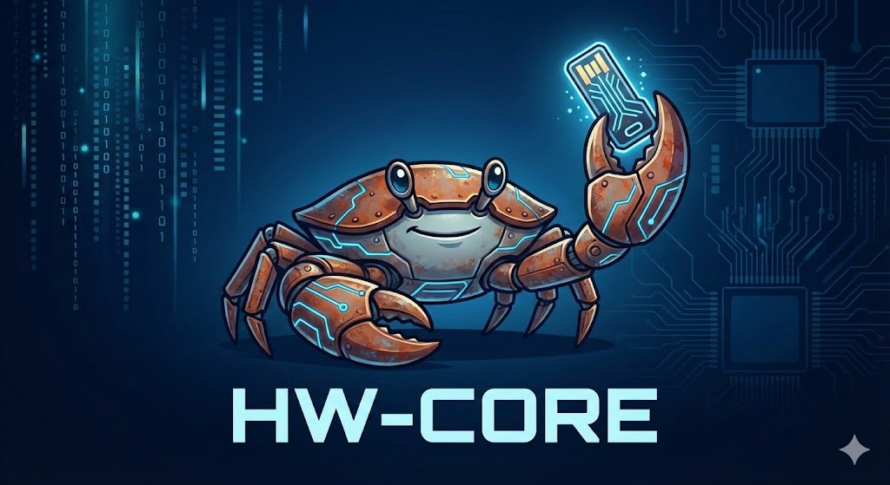
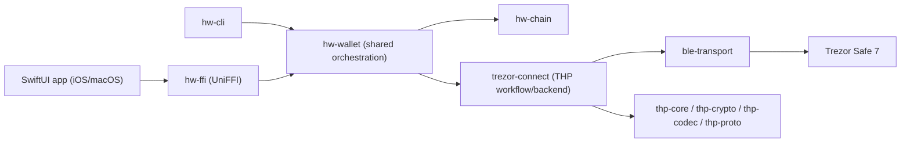

# hw-core

`hw-core` is an early-stage Rust project building a cross-platform hardware wallet interface.

The first production target is THP (Trezor Host Protocol), introduced by Trezor Safe 7. The stack is designed so the same core workflow/orchestration can be reused across multiple app surfaces (CLI now, SwiftUI iOS/macOS via FFI next).

High-level references:

- THP spec: [trezor-firmware/docs/common/communication/thp.md](https://github.com/trezor/trezor-firmware/blob/m1nd3r/thp-documentation/docs/common/communication/thp.md)
- Development and contribution guide: [CONTRIBUTING.md](CONTRIBUTING.md)

## Architecture

## Workspace layout

- `crates/hw-cli`: interactive CLI commands (`scan`, `pair`, `address`, `sign`)
- `crates/hw-ffi`: UniFFI-compatible Rust surface for mobile/desktop apps
- `crates/hw-wallet`: shared wallet logic used by CLI + FFI
- `crates/hw-chain`: chain-level config and helpers (paths, SLIP-44, etc.)
- `crates/trezor-connect`: host-facing THP workflow + backend bridge
- `crates/ble-transport`: BLE manager and profile-specific transport behavior
- `crates/thp-*`: protocol primitives (codec, crypto, state machine, protobuf types)

## Roadmap

Current and planned milestones are tracked in:

- [docs/roadmap.md](docs/roadmap.md)
- [docs/cli-wallet-v1.md](docs/cli-wallet-v1.md)
- [docs/ios-app-plan.md](docs/ios-app-plan.md)

## License

`hw-core` is licensed under **GNU General Public License v3.0 only (GPL-3.0-only)**.
