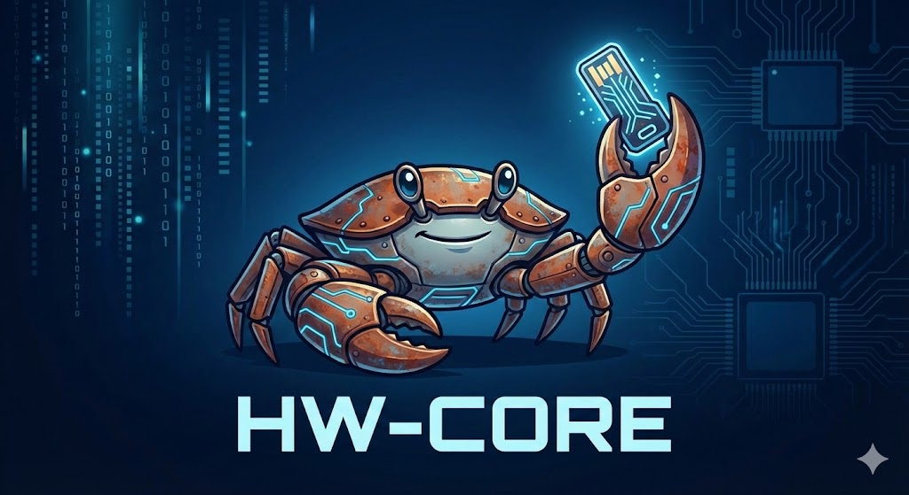
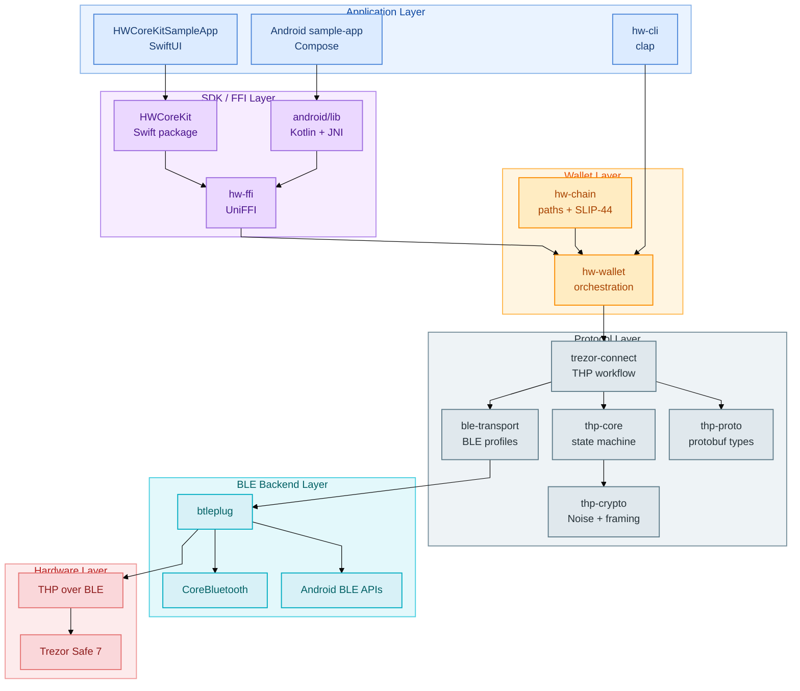

# hw-core

`hw-core` is an early-stage Rust project building a cross-platform hardware wallet interface.

The first production target is THP (Trezor Host Protocol), introduced by Trezor Safe 7. The stack is designed so the same core workflow/orchestration can be reused across multiple app surfaces, including the CLI plus Apple and Android sample apps via FFI.

It doesn't need the Trezor Suite app and can talk to the device directly.

High-level references:

- THP spec: [trezor-firmware/docs/common/communication/thp.md](https://github.com/trezor/trezor-firmware/blob/m1nd3r/thp-documentation/docs/common/communication/thp.md)
- Development and contribution guide: [CONTRIBUTING.md](CONTRIBUTING.md)

## Architecture

```mermaid
%%{init: {'theme':'base', 'flowchart': {'rankSpacing': 28, 'nodeSpacing': 22, 'curve': 'linear'}}}%%
flowchart TB
  subgraph L1["Application Layer"]
    direction LR
    CLI["hw-cli<br/>clap"]
    APPLE_APP["HWCoreKitSampleApp<br/>SwiftUI"]
    ANDROID_APP["Android sample-app<br/>Compose"]
  end

  subgraph L2["SDK / FFI Layer"]
    direction LR
    APPLE_SDK["HWCoreKit<br/>Swift package"]
    FFI["hw-ffi<br/>UniFFI"]
    ANDROID_SDK["android/lib<br/>Kotlin + JNI"]
  end

  subgraph L3["Wallet Layer"]
    direction LR
    CHAIN["hw-chain<br/>paths + SLIP-44"]
    WALLET["hw-wallet<br/>orchestration"]
  end

  subgraph L4["Protocol Layer"]
    direction LR
    CONNECT["trezor-connect<br/>THP workflow"]
    BLE["ble-transport<br/>BLE profiles"]
    THP_CORE["thp-core<br/>state machine"]
    THP_CRYPTO["thp-crypto<br/>Noise + framing"]
    THP_PROTO["thp-proto<br/>protobuf types"]
  end

  subgraph L5["BLE Backend Layer"]
    direction LR
    BTLEPLUG["btleplug"]
    COREBLUETOOTH["CoreBluetooth"]
    ANDROID_BLE["Android BLE APIs"]
  end

  subgraph L6["Hardware Layer"]
    direction LR
    LINK["THP over BLE"]
    DEVICE["Trezor Safe 7"]
  end

  APPLE_APP --> APPLE_SDK
  ANDROID_APP --> ANDROID_SDK
  APPLE_SDK --> FFI
  ANDROID_SDK --> FFI
  FFI --> WALLET
  CHAIN --> WALLET
  CLI --> WALLET
  WALLET --> CONNECT
  CONNECT --> BLE
  CONNECT --> THP_CORE
  CONNECT --> THP_PROTO
  THP_CORE --> THP_CRYPTO
  BLE --> BTLEPLUG
  BTLEPLUG --> COREBLUETOOTH
  BTLEPLUG --> ANDROID_BLE
  BTLEPLUG --> LINK
  LINK --> DEVICE

  style L1 fill:#EAF3FF,stroke:#8AB4E8,stroke-width:1.5px,color:#0D47A1;
  style L2 fill:#F7ECFF,stroke:#B388EB,stroke-width:1.5px,color:#4A148C;
  style L3 fill:#FFF5E1,stroke:#FFB74D,stroke-width:1.5px,color:#E65100;
  style L4 fill:#EEF3F6,stroke:#78909C,stroke-width:1.5px,color:#263238;
  style L5 fill:#E3F8FB,stroke:#4DD0E1,stroke-width:1.5px,color:#006064;
  style L6 fill:#FDEBEC,stroke:#EF9A9A,stroke-width:1.5px,color:#B71C1C;

  classDef appLayer fill:#DCEBFF,stroke:#4D87D9,color:#173B70,stroke-width:1.5px;
  classDef sdkLayer fill:#EBD8FF,stroke:#9C6ADE,color:#4A148C,stroke-width:1.5px;
  classDef walletLayer fill:#FFECC2,stroke:#FB8C00,color:#A84300,stroke-width:1.5px;
  classDef protoLayer fill:#E0E8ED,stroke:#607D8B,color:#263238,stroke-width:1.5px;
  classDef backendLayer fill:#D8F1F7,stroke:#00ACC1,color:#006064,stroke-width:1.5px;
  classDef hwLayer fill:#FAD7DA,stroke:#E57373,color:#8E1C1C,stroke-width:1.5px;

  class CLI,APPLE_APP,ANDROID_APP appLayer;
  class APPLE_SDK,FFI,ANDROID_SDK sdkLayer;
  class CHAIN,WALLET walletLayer;
  class CONNECT,BLE,THP_CORE,THP_CRYPTO,THP_PROTO protoLayer;
  class BTLEPLUG,COREBLUETOOTH,ANDROID_BLE backendLayer;
  class LINK,DEVICE hwLayer;
```

## Connection flow

```mermaid
%%{init: {'theme':'base', 'flowchart': {'rankSpacing': 40, 'nodeSpacing': 35, 'curve': 'basis'}}}%%
flowchart LR
  SCAN["Scan<br/>discover Trezor Safe 7"] --> CONNECT["Connect<br/>open BLE link"]
  CONNECT --> CHANNEL["THP<br/>create_channel"]
  CHANNEL --> HANDSHAKE["Handshake<br/>exchange THP credentials"]
  HANDSHAKE --> PAIR["Pair / Confirm<br/>code entry or paired confirmation"]
  PAIR --> AUTH["Auth Complete<br/>credential exchange + end request"]
  AUTH --> SESSION["Create Session<br/>wallet session bootstrap"]
  SESSION --> READY["Ready<br/>address, sign, reconnect flows"]

  classDef flowStart fill:#E3F2FD,stroke:#1E88E5,color:#0D47A1,stroke-width:1.5px;
  classDef flowMid fill:#FFF8E1,stroke:#FB8C00,color:#E65100,stroke-width:1.5px;
  classDef flowSecure fill:#E8F5E9,stroke:#43A047,color:#1B5E20,stroke-width:1.5px;
  classDef flowEnd fill:#FFEBEE,stroke:#E53935,color:#B71C1C,stroke-width:1.5px;

  class SCAN,CONNECT flowStart;
  class CHANNEL,HANDSHAKE,PAIR,AUTH flowMid;
  class SESSION flowSecure;
  class READY flowEnd;
```

## Workspace layout

- `crates/hw-cli`: interactive CLI commands (`scan`, `pair`, `address`, `sign`)
- `crates/hw-ffi`: UniFFI-compatible Rust surface for mobile/desktop apps
- `crates/hw-wallet`: shared wallet logic used by CLI + FFI
- `crates/hw-chain`: chain-level config and helpers (paths, SLIP-44, etc.)
- `crates/trezor-connect`: host-facing THP workflow + backend bridge
- `crates/ble-transport`: BLE manager and profile-specific transport behavior built on `btleplug`
- `crates/thp-*`: protocol primitives (crypto + framing, state machine, protobuf types)
- `apple/HWCoreKit`: Swift package wrapping generated UniFFI bindings
- `apple/HWCoreKitSampleApp`: iOS/macOS sample app using `HWCoreKit`
- `android/lib`: Android library module wrapping generated UniFFI bindings
- `android/sample-app`: Android sample app consuming `android/lib`

## Roadmap

Current and planned milestones are tracked in:

- [docs/roadmap.md](docs/roadmap.md)
- [docs/plan.md](docs/plan.md)
- [docs/smoke-matrix.md](docs/smoke-matrix.md)
- [docs/release-checklist.md](docs/release-checklist.md)

## License

`hw-core` is licensed under **GNU General Public License v3.0 only (GPL-3.0-only)**.
