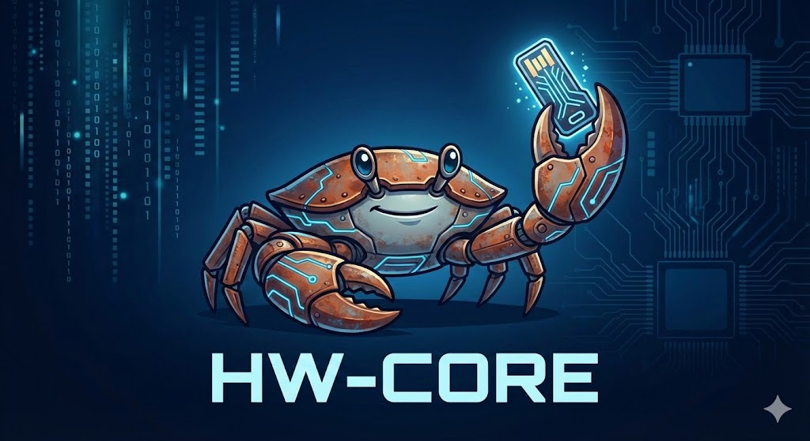
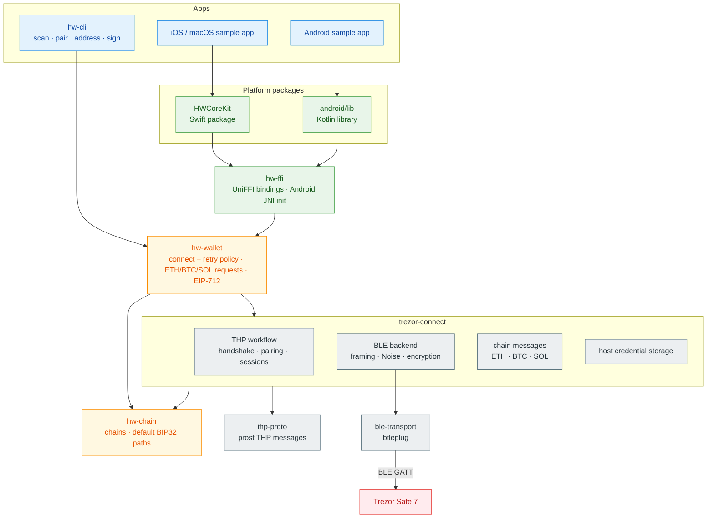

# hw-core

[](https://github.com/hewigovens/hw-core/actions/workflows/ci.yml)
[](https://github.com/hewigovens/hw-core/actions/workflows/audit.yml)
[](SECURITY.md)
[](#license)
[](https://www.rust-lang.org/)
[](https://deepwiki.com/hewigovens/hw-core)



`hw-core` is an early-stage Rust project building a cross-platform hardware wallet interface.

The first production target is THP (Trezor Host Protocol), introduced by Trezor Safe 7. The stack is designed so the same core workflow/orchestration can be reused across multiple app surfaces (the CLI, plus SwiftUI iOS/macOS and Android sample apps via FFI in `apple/` and `android/`).

High-level references:

- THP spec: [trezor-firmware/docs/common/thp/specification.md](https://github.com/trezor/trezor-firmware/blob/main/docs/common/thp/specification.md)
- Development and contribution guide: [CONTRIBUTING.md](CONTRIBUTING.md)

## Architecture


```mermaid
flowchart TB
  subgraph apps["Apps"]
    direction LR
    CLI["hw-cli<br/>scan · pair · address · sign"]
    APPLE["iOS / macOS sample app"]
    ANDROID["Android sample app"]
  end

  subgraph packages["Platform packages"]
    direction LR
    SWIFT["HWCoreKit<br/>Swift package"]
    KOTLIN["android/lib<br/>Kotlin library"]
  end

  FFI["hw-ffi<br/>UniFFI bindings · Android JNI init"]
  WALLET["hw-wallet<br/>connect + retry policy · ETH/BTC/SOL requests · EIP-712"]
  CHAIN["hw-chain<br/>chains · default BIP32 paths"]

  subgraph connect["trezor-connect"]
    direction LR
    WORKFLOW["THP workflow<br/>handshake · pairing · sessions"]
    BACKEND["BLE backend<br/>framing · Noise · encryption"]
    MAPPING["chain messages<br/>ETH · BTC · SOL"]
    STORAGE["host credential storage"]
  end

  PROTO["thp-proto<br/>prost THP messages"]
  BLE["ble-transport<br/>btleplug"]
  DEVICE["Trezor Safe 7"]

  APPLE --> SWIFT --> FFI
  ANDROID --> KOTLIN --> FFI
  CLI --> WALLET
  FFI --> WALLET
  WALLET --> CHAIN
  WALLET --> connect
  connect --> CHAIN
  connect --> PROTO
  BACKEND --> BLE
  BLE -- "BLE GATT" --> DEVICE

  classDef app fill:#E3F2FD,stroke:#1E88E5,color:#0D47A1;
  classDef ffi fill:#E8F5E9,stroke:#43A047,color:#1B5E20;
  classDef wallet fill:#FFF8E1,stroke:#FB8C00,color:#E65100;
  classDef proto fill:#ECEFF1,stroke:#546E7A,color:#263238;
  classDef hw fill:#FFEBEE,stroke:#E53935,color:#B71C1C;
  class CLI,APPLE,ANDROID app;
  class SWIFT,KOTLIN,FFI ffi;
  class WALLET,CHAIN wallet;
  class WORKFLOW,BACKEND,MAPPING,STORAGE,PROTO,BLE proto;
  class DEVICE hw;
```

## Status

| Capability | Ethereum | Bitcoin | Solana |
|---|---|---|---|
| Address retrieval | Done | Done | Done |
| Transaction signing | Partial: no network/token definitions ([#99](https://github.com/hewigovens/hw-core/issues/99)) | Partial: output script-type validation ([#101](https://github.com/hewigovens/hw-core/issues/101)); SLIP-24 not validated on hardware ([#102](https://github.com/hewigovens/hw-core/issues/102)) | Partial: no `additional_info` for token transfers ([#100](https://github.com/hewigovens/hw-core/issues/100)) |
| Message signing | Done (EIP-191 + EIP-712) | Done | Not planned |

Transport is BLE only (Trezor Safe 7). Supported hosts: macOS and Linux (CLI), iOS/macOS via [HWCoreKit](apple/HWCoreKit/README.md), and Android via the [Kotlin library](android/README.md). See [docs/roadmap.md](docs/roadmap.md) for details.

## Quick start

```bash
cargo run -p hw-cli -- scan
cargo run -p hw-cli -- pair            # --force to re-pair
cargo run -p hw-cli -- address --chain eth
cargo run -p hw-cli -- sign-message eth --message "hello"
```

Pairing state is stored at `~/.hw-core/thp-host.json`. Add `-vv` for protocol logs. `just --list` shows the build, test and sample-app recipes; see [CONTRIBUTING.md](CONTRIBUTING.md) for setup, bindings, and the T3W1 emulator integration tests.

## Workspace layout

- `crates/hw-cli`: interactive CLI commands (`scan`, `pair`, `address`, `sign`, `sign-message`)
- `crates/hw-ffi`: UniFFI-compatible Rust surface for mobile/desktop apps
- `crates/hw-wallet`: shared wallet logic used by CLI + FFI
- `crates/hw-chain`: `Chain` enum and `ChainConfig` (code, SLIP-44 coin type, default BIP32 path)
- `crates/trezor-connect`: host-facing THP workflow + backend bridge
- `crates/ble-transport`: BLE manager and profile-specific transport behavior
- `crates/thp-proto`: prost-generated THP protobuf types

## Roadmap

Current and planned milestones are tracked in:

- [docs/roadmap.md](docs/roadmap.md)

## License

`hw-core` is licensed under the **Apache License 2.0** ([LICENSE](LICENSE)).
